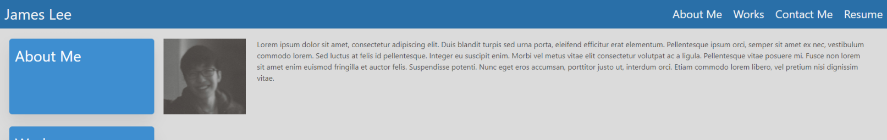
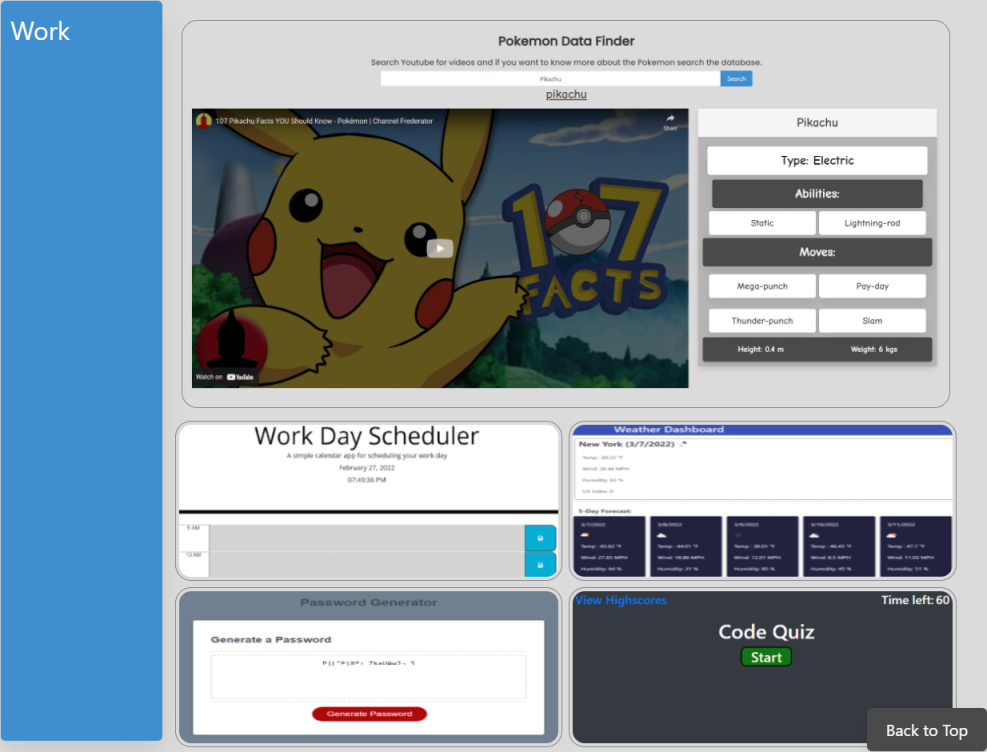
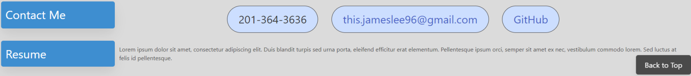

<h1><a href="https://jamehzlee.github.io/Portfolio/">Portfolio</a></h1>

My Portfolio

## Nav / About Me
Clicking the nav bar items scrolls to their sections

## Works 
Click the images to be redirected to their pages

## Contact Info / Resume / Back to Top
My phone number, email, and link to my GitHub profile
 
Clicking the back to top button scrolls the page to the top

